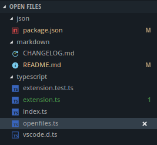

# VS Code Open Files (Alpha)

One day I got tired of dealing with the mess that is the Open Editors widget in vscode, so I decided to do something about
it. The result is this extension, which is really the same thing as Open Editors with the addition of sorted and grouped
files.

## Known Issues

- vscode does not have any API's to retrieve open editors, instead this addon uses a hack which isn't always reliable
  - This hack requires that it cycles through all open files when you start vscode, which isn't very reliable either but it's better than not seeing any files
  - There is a refresh option (under the widget navbar) to manually refresh the list of open files. Otherwise just switching to a file will make it appear.
  - This cannot be solved by this addon. The vscode devs have to add new API's to address this. Please add your +1 here: <https://github.com/Microsoft/vscode/issues/15178>
- vscode appears to open some hidden editors that need to be filtered out. If you see one appear please open up your developer tools, there should be an entry logged for each file added, please copy the relevant one into a bug report so it can be filtered out.

## Todo

- [x] Sort open files
- [x] Group open files by language
- [x] Highlight active file when switching files outside the open files tree view
- [ ] User options to sort by different fields
- [ ] User options to group by different fields
- [ ] Configurable groups (by regex), eg. sort by pattern (models, controllers, ..)
- [ ] Context menu for open files
- [ ] Navbar buttons (create file, open file, ..)
- [ ] ... ?